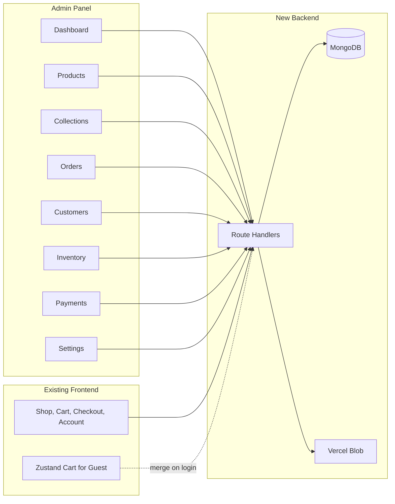

# Backend + Admin System — Implementation Plan (Merged)

**Project:** NOOR-G by Naveed  
**Scope:** Production-ready MongoDB backend, user-based cart, mock Pakistani payments, and a **fully professional admin panel with all management modules**.  
**Constraints:** No changes to existing frontend UI, colors, typography, or layout. Same Next.js 16, Tailwind design tokens, mobile-responsive.

---

## Table of Contents

1. [Current State](#1-current-state)
2. [Architecture Overview](#2-architecture-overview)
3. [Phase 1: Dependencies and Database](#3-phase-1-dependencies-and-database)
4. [Phase 2: Authentication and Middleware](#4-phase-2-authentication-and-middleware)
5. [Phase 3: API Layer](#5-phase-3-api-layer)
6. [Phase 4: Frontend Integration](#6-phase-4-frontend-integration)
7. [Phase 5: Admin Panel (Full Management)](#7-phase-5-admin-panel-full-management)
8. [Phase 6: Data Seeding and Environment](#8-phase-6-data-seeding-and-environment)
9. [Phase 7: Quality and Compatibility](#9-phase-7-quality-and-compatibility)
10. [File Change Summary](#10-file-change-summary)
11. [Order of Implementation](#11-order-of-implementation)

---

## 1. Current State

- **Auth:** NextAuth v5, Google OAuth, JWT; session has `user.id` and `user.role`; `authorized` callback protects `/account/*`; no middleware file yet.
- **Data:** All APIs use in-memory mock data (`src/lib/mockData.ts`, `src/lib/mockOrders.ts`); products, collections, cart, orders are stubs.
- **Cart:** Zustand + localStorage only; no DB.
- **Checkout:** Builds order client-side, POST to `/api/orders` (stub); no payment method selection, no Payment record.
- **Account orders:** Read from mock orders; no real user filtering.

---

## 2. Architecture Overview

---

## 3. Phase 1: Dependencies and Database

### 3.1 Dependencies

- Add: `mongoose`, `@vercel/blob`.
- No new auth package; keep NextAuth v5.

### 3.2 MongoDB Connection

- **File:** `src/lib/db/mongodb.ts`
- Connect with `mongoose.connect(MONGODB_URI)`; reuse connection in serverless (check `mongoose.connection.readyState`).
- Env: `MONGODB_URI` or `DATABASE_URL`.

### 3.3 Mongoose Models

Location: `src/lib/db/models/`. Align with existing types in `src/types/index.ts` and `src/lib/constants.ts`.

| Model | Key fields |
|-------|------------|
| **User** | name, email, image, role (ADMIN \| CUSTOMER), createdAt |
| **Product** | name, slug (unique), description, price, salePrice, images[], variants[] (size, color, stock, sku), status, categoryId/collectionIds, material, rating, SKU, createdAt |
| **Collection** | name, slug, description, image, displayOrder, productIds[] |
| **Order** | orderNumber, userId, items[], shippingAddress, totalAmount, subtotal, shippingFee, orderStatus, paymentStatus, createdAt |
| **Payment** | orderId, method (EASYPAISA \| JAZZCASH \| BANK_TRANSFER), status (PENDING \| PAID \| FAILED), referenceNumber (mock), createdAt |
| **Cart** | userId (unique), items[] (productId, variantSKU, quantity), updatedAt |

- Add `PAYMENT_METHOD` (EASYPAISA, JAZZCASH, BANK_TRANSFER) in `src/lib/constants.ts`.
- Product: images as `[{ url, altText, order }]`; variants as `[{ size, color, stock, variantSKU }]` to match frontend types.

---

## 4. Phase 2: Authentication and Middleware

### 4.1 Persist User and Role in MongoDB

- On first sign-in: create or update User in MongoDB by email; default `role: CUSTOMER`.
- Admin: seed one user with `role: ADMIN` (e.g. by email in seed script) or env `ADMIN_EMAIL` and set role in NextAuth callback when email matches.
- NextAuth callbacks: in `jwt`, after Google sign-in, fetch/create User in DB and set `token.role = user.role` from MongoDB. Keep session shape (`user.id`, `user.role`).

### 4.2 Middleware

- **File:** `src/middleware.ts` (root).
- Use NextAuth middleware.
- Rules: `/admin` and `/admin/*` allow only `session?.user?.role === "ADMIN"`; `/account` and `/account/*` allow only authenticated. Redirect to `/login?callbackUrl=...` otherwise.

---

## 5. Phase 3: API Layer

### 5.1 Response and Validation Helpers

- **File:** `src/lib/api/response.ts` — `success<T>(data, status?)`, `error(message, status?)` returning consistent `NextResponse.json`.

### 5.2 Products API

- GET/POST `src/app/api/products/route.ts`: GET from MongoDB (slug, id, q); POST admin-only, Zod-validated, slug unique.
- GET/PATCH/DELETE `src/app/api/products/[id]/route.ts`: GET public (active); PATCH/DELETE admin-only.
- POST `src/app/api/products/upload/route.ts`: admin-only; FormData → Vercel Blob; return URLs.

### 5.3 Collections API

- GET `src/app/api/collections/route.ts` and `[slug]/route.ts`: from MongoDB; same response shape as today.

### 5.4 Cart API (User-Based)

- GET/POST `src/app/api/cart/route.ts`: require auth; by userId; POST upsert line (productId, variantSKU, quantity).
- PATCH/DELETE `src/app/api/cart/items/[itemId]/route.ts`: require auth; update quantity or remove line.
- Optional: POST `src/app/api/cart/merge/route.ts` for guest cart merge on login.

### 5.5 Orders API

- GET `src/app/api/orders/route.ts`: require auth; by userId.
- POST: require auth; Zod body; create Order + Payment (mock); return order.
- GET `src/app/api/orders/[id]/route.ts`: require auth; user’s own or admin.

### 5.6 Payments (Mock)

- POST `src/app/api/payments/confirm/route.ts`: body `{ orderId }`; set Payment.status = PAID, Order.paymentStatus = PAID (mock).

### 5.7 Admin-Only APIs

- `requireAdmin()` helper: `getServerSession` + `session.user.role === 'ADMIN'`; 401/403 otherwise.
- Admin product CRUD and upload use `requireAdmin()`.
- **Admin Collections:** GET list (admin), POST/PATCH/DELETE collections (admin).
- **Admin Users/Customers:** GET `/api/admin/users` (list, paginated), GET `/api/admin/users/[id]` (profile + orders).
- **Admin Payments:** GET `/api/admin/payments` (list all).
- **Admin Inventory:** Reuse products with variants or GET `/api/admin/inventory` (products + variant stock); PATCH variant stock via product PATCH or dedicated endpoint.

---

## 6. Phase 4: Frontend Integration (No Visual Changes)

- **Products/Collections:** Existing pages fetch `/api/products` and `/api/collections`; switch API to MongoDB; response shape unchanged.
- **Cart:** Guest = Zustand; logged-in = GET `/api/cart` and mutations; merge guest cart on login (callback or merge endpoint).
- **Checkout:** Add payment step (select EASYPAISA | JAZZCASH | BANK_TRANSFER); POST `/api/orders` then POST `/api/payments/confirm`; clear cart.
- **Account orders:** APIs filtered by userId; response shape unchanged.

---

## 7. Phase 5: Admin Panel (Full Management)

**Design:** Same NOOR-G design tokens (primaryDark #333333, goldAccent #C4A747, cream #F5F3EE, sage #5BA383). Mobile-responsive. Sidebar (desktop) + hamburger/drawer (mobile). All `/admin/*` protected by middleware (ADMIN only).

### 7.1 Dashboard (`/admin`)

- **Overview:** Orders count (today / week / month), total revenue (mock), recent orders (last 5–10).
- **Alerts:** Low-stock variants (e.g. stock < 5), pending orders count.
- **Quick links:** Products, Collections, Orders, Customers, Inventory, Payments, Settings.
- **Optional:** Simple mock chart (orders/revenue last 7 days).

### 7.2 Products (`/admin/products`)

- **List:** Table/cards — name, image, price, sale price, status, stock summary; search by name/slug; filter by status (Active/Draft/Archived); actions Edit, Delete.
- **New:** `/admin/products/new` — form: name, slug (auto/editable), description, price, salePrice, material, categoryId/collectionIds, status, images (Vercel Blob upload), variants (size, color, stock, SKU). Zod validation.
- **Edit:** `/admin/products/[id]/edit` — same form + Delete; optional Duplicate.
- **Optional:** Bulk actions (select multiple → update status or delete).

### 7.3 Collections (`/admin/collections`)

- **List:** Name, slug, image, product count, display order; Edit, Delete.
- **New:** `/admin/collections/new` — name, slug, description, image (upload/URL), display order, product assignment (multi-select productIds).
- **Edit:** `/admin/collections/[id]/edit` — same; reorder products in collection.

### 7.4 Orders (`/admin/orders`)

- **List:** Table — order number, customer name/email, total, order status, payment status, date; search by order number/email; filter by status and date range.
- **Detail:** `/admin/orders/[id]` — full order (items, shipping, totals), payment method + mock reference; **update order status** (PENDING → CONFIRMED → PROCESSING → SHIPPED → DELIVERED) and **payment status** (PENDING → PAID/FAILED); optional internal note.
- **Optional:** Export orders CSV.

### 7.5 Customers (`/admin/customers`)

- **List:** Table — name, email, image, role (CUSTOMER), orders count, last order date, registered date; search by name/email; filter by “has orders”.
- **Detail:** `/admin/customers/[id]` — profile (name, email, image, createdAt), list of their orders (read-only links to order detail).

### 7.6 Inventory (`/admin/inventory`)

- **Overview:** All products with variants — product name, variant (size/color), SKU, stock, status (In stock / Low / Out of stock); filter by low stock (e.g. < 5) or out of stock.
- **Quick edit:** Inline or modal to update variant stock; save via PATCH product or dedicated endpoint. Alternative: “Edit” links to product edit with variant section.

### 7.7 Payments (`/admin/payments`)

- **List:** All payment records — order number, method (EASYPAISA/JAZZCASH/BANK_TRANSFER), amount, status (PENDING/PAID/FAILED), reference number (mock), date; filter by method/status.
- **Detail:** Link to order; show payment method and mock reference; status updates can be done from order detail.

### 7.8 Settings (`/admin/settings`)

- **Admin profile (optional):** Display name, email from session.
- **Site settings (optional):** Placeholder for future (store name, contact email).
- **Payment methods:** Read-only list of mock methods (Easypaisa, JazzCash, Bank Transfer) and “Mock mode” note.

### 7.9 Admin Layout and Navigation

- **Sidebar (desktop):** Logo/brand; Dashboard, Products, Collections, Orders, Customers, Inventory, Payments, Settings; collapsible; NOOR-G colors (cream bg, gold accent for active).
- **Mobile:** Hamburger → same links; bottom nav or drawer.
- **Header:** Admin title, current user (name/avatar), logout.
- **Breadcrumbs:** e.g. Dashboard > Products > Edit “X”.

### 7.10 Admin Management Summary

| Module     | List | Create | Edit | Delete | Special |
|------------|------|--------|------|--------|---------|
| Dashboard  | —    | —      | —    | —      | Overview, alerts, quick links |
| Products   | Yes  | Yes    | Yes  | Yes    | Image upload, variants, bulk (optional) |
| Collections| Yes  | Yes    | Yes  | Yes    | Assign products, display order |
| Orders     | Yes  | —      | Status| —      | Detail, payment status |
| Customers  | Yes  | —      | —    | —      | Detail + order history |
| Inventory  | Yes  | —      | Stock| —      | Low-stock filter, quick edit |
| Payments   | Yes  | —      | —    | —      | Detail, status from order |
| Settings   | —    | —      | Optional | —    | Profile, payment methods (read-only) |

---

## 8. Phase 6: Data Seeding and Environment

### 8.1 Seed Script (Optional)

- **File:** `scripts/seed.ts` (run with `tsx` or `ts-node`).
- Create one User with admin email and `role: ADMIN`; optionally seed Products and Collections from current `MOCK_PRODUCTS` / `MOCK_COLLECTIONS`.

### 8.2 Environment Variables

- **Existing:** AUTH_SECRET, AUTH_GOOGLE_ID, AUTH_GOOGLE_SECRET, NEXT_PUBLIC_SITE_URL.
- **New:** MONGODB_URI (or DATABASE_URL), BLOB_READ_WRITE_TOKEN. Optional: ADMIN_EMAIL.

### 8.3 .env.example

- Document all variables; no secrets committed.

---

## 9. Phase 7: Quality and Compatibility

- All API request bodies validated with Zod; extend `src/lib/validations/`.
- Keep `src/types/index.ts` as source of truth; map Mongoose docs to these types in handlers.
- Consistent API response format via `response.ts` helpers.
- No removal of existing frontend functionality; mock data can remain as dev fallback until API is verified.

---

## 10. File Change Summary

| Area   | New files | Modified files |
|--------|-----------|----------------|
| DB     | `src/lib/db/mongodb.ts`, `src/lib/db/models/*.ts` (User, Product, Order, Payment, Cart, Collection) | — |
| Auth   | — | `src/app/api/auth/[...nextauth]/route.ts` |
| Middleware | `src/middleware.ts` | — |
| API    | `src/lib/api/response.ts`, `src/app/api/products/upload/route.ts`, `src/app/api/payments/confirm/route.ts`, `src/app/api/admin/users/route.ts`, `src/app/api/admin/users/[id]/route.ts`, `src/app/api/admin/payments/route.ts`, optional `src/app/api/admin/inventory/route.ts`, `src/app/api/admin/collections/route.ts` (admin CRUD) | All existing product, collection, cart, order API routes → MongoDB + auth |
| Constants | — | `src/lib/constants.ts` (PAYMENT_METHOD) |
| Validations | — | `src/lib/validations/index.ts` |
| Checkout | — | `src/app/(shop)/checkout/page.tsx` (payment step, APIs, clear cart) |
| Cart/Header | — | Cart page + Header: API when logged in, merge on login |
| Admin  | `src/app/(admin)/layout.tsx`, `admin/page.tsx`, `admin/products/page.tsx`, `admin/products/new/page.tsx`, `admin/products/[id]/edit/page.tsx`, `admin/collections/page.tsx`, `admin/collections/new/page.tsx`, `admin/collections/[id]/edit/page.tsx`, `admin/orders/page.tsx`, `admin/orders/[id]/page.tsx`, `admin/customers/page.tsx`, `admin/customers/[id]/page.tsx`, `admin/inventory/page.tsx`, `admin/payments/page.tsx`, `admin/settings/page.tsx` | — |
| Seed/Env | `scripts/seed.ts`, `.env.example` | `package.json` (mongoose, @vercel/blob, tsx) |

---

## 11. Order of Implementation

1. Dependencies + MongoDB connection + Mongoose models (User, Product, Collection, Order, Payment, Cart).
2. NextAuth: sync User to DB on sign-in, role from DB; seed or ADMIN_EMAIL for first admin.
3. Middleware: protect `/admin/*` (ADMIN) and `/account/*` (authenticated).
4. API response helpers + Zod schemas.
5. Products API (GET/POST from DB; GET/PATCH/DELETE by id; upload route).
6. Collections API (GET list + GET by slug from DB).
7. Cart API (GET/POST/PATCH/DELETE) with auth; optional merge endpoint.
8. Orders API (GET by userId, POST create order + payment); GET order by id; payments/confirm mock.
9. Frontend: cart + header use API when logged in; merge guest cart on login; checkout payment step and new APIs; clear cart after order.
10. Admin layout + Dashboard + Products (list/new/edit + upload) + Collections (list/new/edit) + Orders (list/detail + status) + Customers (list/detail) + Inventory (list + quick edit) + Payments (list) + Settings.
11. Admin APIs: collections CRUD (admin), users list/detail, payments list, inventory (reuse or dedicated).
12. Seed script + .env.example.

---

*Merged plan: backend + full admin panel with all management modules. No changes to existing storefront UI.*
